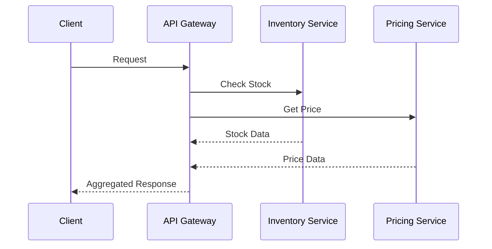

# Finalization Phase

Clean up the implementation, update documentation, and prepare for review.

## 1. Code Cleanup

### Remove Development Artifacts
```bash
# Remove debug statements from each service
grep -r "console.log\|print\|fmt.Println.*DEBUG\|log.debug" api-gateway/ inventory-service/ pricing-service/

# Remove commented code
grep -r "^[[:space:]]*//.*TODO\|^[[:space:]]*#.*TODO" api-gateway/ inventory-service/ pricing-service/

# Clean up temporary files
find . -name "*.tmp" -o -name "*.bak" -o -name "*~" | xargs rm -f
```

### Code Formatting

#### Python (API Gateway)
```bash
cd api-gateway
# Format with black
black .
# Sort imports
isort .
# Lint with flake8
flake8 .
# Type check with mypy (if used)
mypy .
```

#### Java (Inventory Service)
```bash
cd inventory-service
# Format with Maven
./mvnw spotless:apply
# Or use built-in formatter
./mvnw spring-javaformat:apply
```

#### Go (Pricing Service)
```bash
cd pricing-service
# Format code
go fmt ./...
# Run go vet
go vet ./...
# Run golint (if available)
golint ./...
# Clean up dependencies
go mod tidy
```

## 2. Documentation Updates

### Update API Documentation

Create/Update `docs/API.md`:
```markdown
# API Documentation

## New/Modified Endpoints

### Endpoint Name
- **Method**: GET/POST/PUT/DELETE
- **Path**: `/api/v1/resource`
- **Description**: What it does
- **Request Headers**:
  - `X-Correlation-Id`: Optional correlation ID
  - `Content-Type`: application/json
- **Request Body**:
  ```json
  {
    "field": "value"
  }
  ```
- **Response** (200 OK):
  ```json
  {
    "result": "data"
  }
  ```
- **Error Responses**:
  - 400 Bad Request
  - 404 Not Found
  - 500 Internal Server Error

## Request Flow Diagrams


```

### Update README if needed
- Add new setup instructions
- Document new environment variables
- Update architecture diagrams
- Add new request patterns

### Create Migration Guide (if breaking changes)
`docs/MIGRATION.md`:
- List breaking changes
- Provide migration steps
- Include examples

## 3. Final Testing Suite

### Run All Tests
```bash
# Python tests
cd api-gateway
python -m pytest tests/ -v --cov=app --cov-report=term-missing

# Java tests
cd inventory-service
./mvnw clean test
./mvnw jacoco:report  # Coverage report

# Go tests
cd pricing-service
go test ./... -v -cover
go test -race ./...  # Race condition detection
```

### Docker Build Verification
```bash
# Rebuild all images
docker-compose build --no-cache

# Run with fresh images
docker-compose down -v  # Remove volumes
docker-compose up -d

# Run smoke tests
./scripts/smoke-test.sh
```

### Final Integration Test
```bash
# Run complete test suite
python tests/integration/test_all_patterns.py

# Load test final check
k6 run scripts/load-test.js --summary-trend-stats="avg,min,med,max,p(95),p(99)"
```

## 4. Security Review

### Check for Sensitive Data
```bash
# Check for hardcoded secrets
grep -r "password\|secret\|key\|token" --include="*.py" --include="*.java" --include="*.go" \
  --exclude-dir=".git" --exclude-dir="node_modules" --exclude-dir="target"

# Verify .env files are in .gitignore
grep -q "\.env" .gitignore || echo ".env" >> .gitignore

# Check for exposed ports in docker-compose
grep -A2 -B2 "ports:" docker-compose.yml
```

### Dependency Vulnerability Scan
```bash
# Python
cd api-gateway
pip-audit  # If available
safety check  # Alternative

# Java
cd inventory-service
./mvnw dependency-check:check

# Go
cd pricing-service
go list -json -deps ./... | nancy sleuth  # If available
# Or use: govulncheck ./...
```

## 5. Performance Verification

### Resource Usage Check
```bash
# Check container resources
docker stats --no-stream

# Memory profiling (if implemented)
curl http://localhost:8000/debug/pprof/heap > heap.prof  # Go service
```

### Response Time Verification
```bash
# Quick benchmark
ab -n 1000 -c 10 http://localhost:8000/api/v1/products/123 | grep "Time per request"
```

## 6. Create Final Summary

Create `task_work/task_summary.md`:
```markdown
# Task Implementation Summary

## Overview
Brief description of what was implemented

## Changes Made

### API Gateway
- Files modified: [list]
- New endpoints: [list]
- Dependencies added: [list]

### Inventory Service
- Files modified: [list]
- Database changes: [describe]
- New features: [list]

### Pricing Service
- Files modified: [list]
- New algorithms: [describe]
- Cache improvements: [describe]

## Testing Performed
- Unit tests: XX tests, XX% coverage
- Integration tests: XX scenarios tested
- Load tests: XXX req/sec achieved
- Chaos tests: [describe results]

## Distributed Tracing Improvements
- Correlation ID implementation
- Trace context propagation
- Error tracking enhancements
- Observability gaps addressed

## Performance Impact
- Baseline latency: XXms
- New latency: XXms
- Memory usage: XX MB
- CPU usage: XX%

## Known Limitations
- [List any known issues or limitations]
- [Future improvement suggestions]

## API Changes
- New endpoints: [list with brief description]
- Modified endpoints: [list with changes]
- Deprecated endpoints: [if any]

## Configuration Changes
- New environment variables: [list]
- New configuration files: [list]
- Docker changes: [describe]

## Breaking Changes
- [List any breaking changes]
- [Migration required: yes/no]

## Review Checklist
- [ ] All tests passing
- [ ] Documentation updated
- [ ] No security issues
- [ ] Performance acceptable
- [ ] Docker build works
- [ ] Integration tests pass
- [ ] Code formatted
- [ ] No debug code
```

## 7. Prepare for Review

### Git Operations
```bash
# Commit the summary
git add task_work/task_summary.md
git commit -m "docs: add task implementation summary"

# Clean up work directory
rm -rf task_work/
git add .
git commit -m "chore: clean up task work directory"

# Review all changes
git log --oneline -10
git diff main...HEAD --stat

# Push to remote
git push origin feature/task-name
```

### Final Checklist
- [ ] All services build successfully
- [ ] All tests pass
- [ ] Documentation is complete
- [ ] No security vulnerabilities
- [ ] Performance meets requirements
- [ ] Docker environment works
- [ ] Code follows standards
- [ ] No temporary files committed
- [ ] Feature branch is up to date with main

## 8. Pull Request Preparation

### PR Description Template
```markdown
## Description
Brief description of changes

## Type of Change
- [ ] Bug fix
- [ ] New feature
- [ ] Performance improvement
- [ ] Documentation update

## Testing
- [ ] Unit tests pass
- [ ] Integration tests pass
- [ ] Manual testing completed
- [ ] Load testing performed

## Checklist
- [ ] Code follows project standards
- [ ] Documentation updated
- [ ] All tests passing
- [ ] No security issues

## Screenshots/Logs
[If applicable]

## Related Issues
Fixes #XXX
```

## Next Steps

- Create pull request
- Request code review
- Address review feedback
- Monitor CI/CD pipeline
- Prepare for deployment

## Rollback Plan

Document how to rollback if needed:
1. Revert commit: `git revert <commit-hash>`
2. Restore database state (if changed)
3. Clear caches (if applicable)
4. Restart services
5. Verify system health